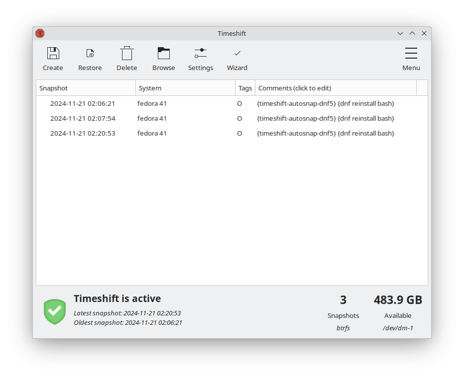

# timeshift-autosnap-dnf5
Timeshift auto-snapshot script for RPM based systems using dnf5 which creates snapshots of your system with timeshift before a package install, remove or upgrade using pre_transaction:::: hook in libdnf5-plugin-actions. Fork of timeshift-autosnap-apt from wmutschl.

## Features
*  This script is a fork of [timeshift-autosnap-apt](https://github.com/wmutschl/timeshift-autosnap-apt) from [wmutschl](https://github.com/wmutschl), but adapted for usage with the dnf5 package manager of RPM based systems such as Fedora 41.
*  Creates [Timeshift](https://github.com/teejee2008/timeshift) snapshots with a unique (customizable) comment.
*  Keeps only a certain number of snapshots created using this script.
*  Deletes old snapshots which are created using this script.
*  Makes a copy with RSYNC of `/boot` and `/boot/efi` to `/boot.backup` before the call to Timeshift for more flexible restore options.
*  Can be manually executed by running `sudo timeshift-autosnap-dnf5`.
*  Autosnaphots can be temporarily skipped by setting "SKIP_AUTOSNAP" environment variable (e.g. `sudo SKIP_AUTOSNAP= dnf upgrade`)
*  Supports [grub-btrfs](https://github.com/Antynea/grub-btrfs) which automatically creates boot menu entries of all your btrfs snapshots into grub.
*  For a tutorial how to use this script in production to easily rollback your system, see [System Recovery with Timeshift](https://mutschler.dev/linux/timeshift/).

## Installation
#### Install dependencies
```bash
sudo dnf install git make libdnf5-plugin-actions
```
#### Install and configure Timeshift
```bash
sudo dnf install timeshift
```
Open Timeshift and configure it either using btrfs or rsync. I recommend using btrfs as a filesystem for this, see wmutschl's [btrfs installation guide](https://mutschler.dev/linux/fedora-btrfs-33/) for Fedora.

#### Main installation
Clone this repository and install the script and configuration file with make:
```bash
git clone https://github.com/CalliopeSystem/timeshift-autosnap-dnf5.git
cd /home/$USER/timeshift-autosnap-dnf5
sudo make install
```
After this, make changes to the configuration file:
```bash
sudo nano /etc/timeshift-autosnap-dnf5.conf
```
For example, if you don't have a dedicated `/boot` partition, then you should set `snapshotBoot=false`. This will still make a copy of `/boot/efi`.

#### Optionally, install `grub-btrfs`
[grub-btrfs](https://github.com/Antynea/grub-btrfs) is a great package which will include all btrfs snapshots into the Grub menu. Clone and install it:
```bash
git clone https://github.com/Antynea/grub-btrfs.git /home/$USER/grub-btrfs
cd /home/$USER/grub-btrfs
sudo make install
```
By default grub-btrfs creates menu entries for snapper snapshots, how to change this:
```
sudo systemctl edit --full grub-btrfsd
```
Change
```
ExecStart=/usr/bin/grub-btrfsd --syslog /.snapshots
```
to
```
ExecStart=/usr/bin/grub-btrfsd --syslog --timeshift-auto
```
Then run
```
sudo systemctl enable --now grub-btrfsd
```

#### Configuration
The configuration file is located in `/etc/timeshift-autosnap-dnf5.conf`. You can set the following options:
*  `snapshotBoot`: If set to **true** /boot folder will be cloned with rsync into /boot.backup before the call to Timeshift. Note that this will not include the /boot/efi folder. Default: **true**
*  `snapshotEFI`: If set to **true** /boot/efi folder will be cloned with rsync into /boot.backup/efi before the call to Timeshift. Default: **true**
*  `skipAutosnap`: If set to **true** script won't be executed. Default: **false**.
*  `deleteSnapshots`: If set to **false** old snapshots won't be deleted. Default: **true**
*  `maxSnapshots`: Defines **maximum** number of old snapshots to keep. Default: **3**


## Test functionality
To test the functionality, simply run
```bash
sudo timeshift-autosnap-dnf5
``` 
Or try (re)installing some package `maxSnapshots` number of times, e.g.
```bash
sudo dnf reinstall bash
sudo dnf reinstall bash
sudo dnf reinstall bash
```
You should see output for BTRFS similar to
```bash
# Using system disk as snapshot device for creating snapshots in BTRFS mode
#
# /dev/dm-1 is mounted at: /run/timeshift/backup, options: rw,relatime,compress=zstd:3,ssd,space_cache,commit=120,subvolid=5,subvol=/
#
# Creating new backup...(BTRFS)
# Saving to device: /dev/dm-1, mounted at path: /run/timeshift/backup
# Created directory: /run/timeshift/backup/timeshift-btrfs/snapshots/2020-04-29_09-46-30
# Created subvolume snapshot: /run/timeshift/backup/timeshift-btrfs/snapshots/2020-04-29_09-46-30/@
# Created subvolume snapshot: /run/timeshift/backup/timeshift-btrfs/snapshots/2020-04-29_09-46-30/@home
# Created control file: /run/timeshift/backup/timeshift-btrfs/snapshots/2020-04-29_09-46-30/info.json
# BTRFS Snapshot saved successfully (0s)
# Tagged snapshot '2020-04-29_09-46-30': ondemand
# --------------------------------------------------------------------------
```
or for RSYNC similar to
```bash
# /dev/vdb1 is mounted at: /run/timeshift/backup, options: rw,relatime
# ------------------------------------------------------------------------------
# Creating new snapshot...(RSYNC)
# Saving to device: /dev/vdb1, mounted at path: /run/timeshift/backup
# Synching files with rsync...
# Created control file: /run/timeshift/backup/timeshift/snapshots/2020-04-29_10-25-35/info.json
# RSYNC Snapshot saved successfully (6s)
# Tagged snapshot '2020-04-29_10-25-35': ondemand
------------------------------------------------------------------------------
```

Open timeshift and see whether there are `maxSnapshots` packages:


Close timeshift and reinstall the package another time and you should see that the first package is now deleted:
```bash
sudo dnf reinstall bash
#
# Using system disk as snapshot device for creating snapshots in BTRFS mode
# /dev/dm-1 is mounted at: /run/timeshift/backup, options: rw,relatime,compress=zstd:3,ssd,space_cache,commit=120,subvolid=5,subvol=/
# Creating new backup...(BTRFS)
# Saving to device: /dev/dm-1, mounted at path: /run/timeshift/backup
# Created directory: /run/timeshift/backup/timeshift-btrfs/snapshots/2020-04-29_09-53-25
# Created subvolume snapshot: /run/timeshift/backup/timeshift-btrfs/snapshots/2020-04-29_09-53-25/@
# Created subvolume snapshot: /run/timeshift/backup/timeshift-btrfs/snapshots/2020-04-29_09-53-25/@home
# Created control file: /run/timeshift/backup/timeshift-btrfs/snapshots/2020-04-29_09-53-25/info.json
# BTRFS Snapshot saved successfully (0s)
# Tagged snapshot '2020-04-29_09-53-25': ondemand
# ------------------------------------------------------------------------------
# 
# /dev/dm-1 is mounted at: /run/timeshift/backup, options: rw,relatime,compress=zstd:3,ssd,space_cache,commit=120,subvolid=5,subvol=/
# 
# ------------------------------------------------------------------------------
# Removing snapshot: 2020-04-29_09-46-30
# Deleting subvolume: @home (Id:662)
# Deleted subvolume: @home (Id:662)
# 
# Destroying qgroup: 0/662
# Destroyed qgroup: 0/662
# 
# Deleting subvolume: @ (Id:661)
# Deleted subvolume: @ (Id:661)
# 
# Destroying qgroup: 0/661
# Destroyed qgroup: 0/661
# 
# Deleted directory: /run/timeshift/backup/timeshift-btrfs/snapshots/2020-04-29_09-46-30
# Removed snapshot: 2020-04-29_09-46-30
# ------------------------------------------------------------------------------
```
or for RSYNC:

```bash
# /dev/vdb1 is mounted at: /run/timeshift/backup, options: rw,relatime
# 
# ------------------------------------------------------------------------------
# Creating new snapshot...(RSYNC)
# Saving to device: /dev/vdb1, mounted at path: /run/timeshift/backup
# Linking from snapshot: 2020-04-29_10-25-15
# Synching files with rsync...
# Created control file: /run/timeshift/backup/timeshift/snapshots/2020-04-29_10-25-35/info.json
# RSYNC Snapshot saved successfully (6s)
# Tagged snapshot '2020-04-29_10-25-35': ondemand
# ------------------------------------------------------------------------------
# 
# /dev/vdb1 is mounted at: /run/timeshift/backup, options: rw,relatime
# 
# ------------------------------------------------------------------------------
# Removing '2020-04-29_10-24-35'...
# Removed '2020-04-29_10-24-35'                                                   
# ------------------------------------------------------------------------------
```
---

### Uninstallation
```
cd /home/$USER/timeshift-autosnap-dnf5
sudo make uninstall
```

---

**All new ideas and contributors are much appreciated and welcome, just open an issue for that!**
